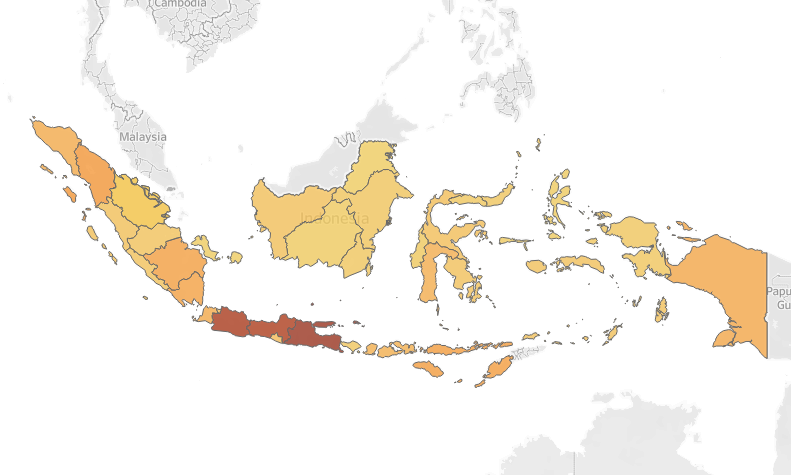
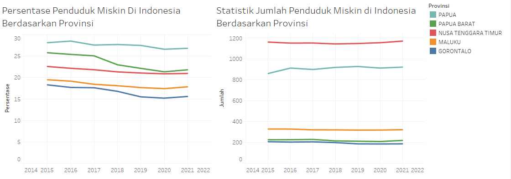
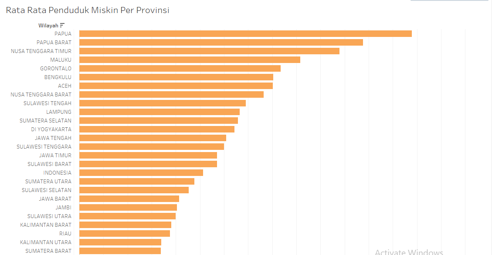
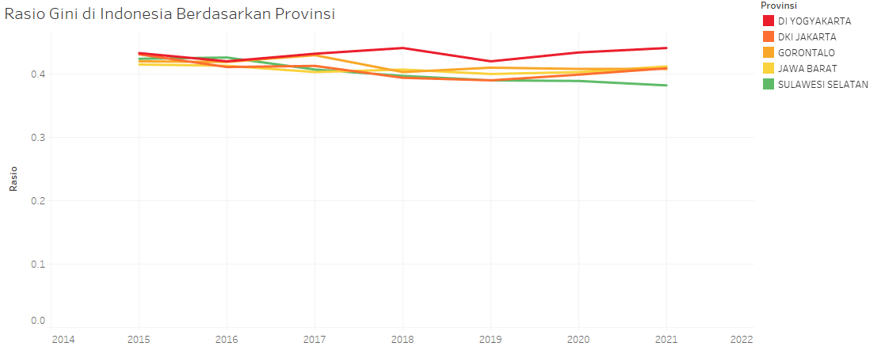

**# No-Poverty-Indonesia-Kelompok-2**

Ketua Proyek : Reyhan Afrizal 

Anggota: 
- Annisa Sugi Pramesty 
- Irvan F 
- Naufal Riqullah

**Visualisasi Data**

**Peta Penyebaran Kemiskinan di Indonesia**

**Persentase dan Jumlah Penduduk Miskin Berdasarkan Provinsi**

**Rata - Rata Persentase Penduduk Miskin di Indonesia**

**Rasio Gini Berdasarkan Provinsi**

**Garis Kemiskinan Makanan dan Non-Makanan Berdasarkan Provinsi**

